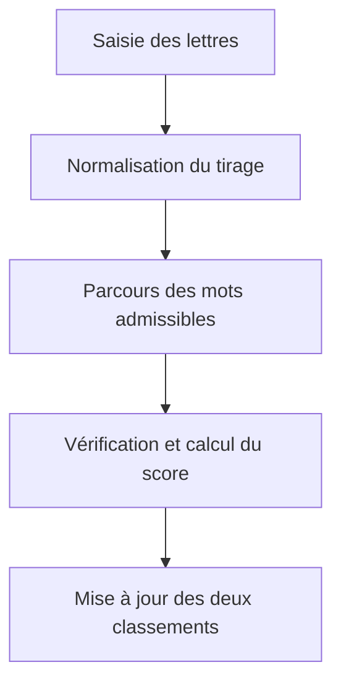

# Algorithme de recherche et de classement des mots

Ce document décrit l'algorithme utilisé par `engine.py` pour déterminer, à
partir d'une série de lettres :

- les N mots les plus longs qui peuvent être formés ;
- les N mots dont les lettres rapportent le plus de points au Scrabble
  français.

Les définitions du Wiktionnaire sont recherchées dans un second temps et
n'interviennent jamais dans la sélection ou le classement des mots.

## Vue d'ensemble



## 1. Préparation du dictionnaire

Le dictionnaire est chargé une seule fois au lancement de l'application. Pour
chaque ligne du fichier :

1. le mot est converti en majuscules ;
2. sa longueur et son format sont vérifiés ;
3. les doublons sont éliminés ;
4. le nombre d'occurrences de chacune des 26 lettres est calculé ;
5. la valeur totale des lettres est précalculée ;
6. le mot est rangé dans le groupe correspondant à sa longueur.

Chaque mot est donc représenté en mémoire par trois éléments :

```text
mot, tableau_de_26_compteurs, score_de_base
```

Le tableau de compteurs est enregistré sous la forme compacte de 26 octets.
Les mots sont regroupés par longueur, de 2 à 15 lettres. Lors d'une recherche,
l'algorithme peut ainsi ignorer immédiatement tous les mots plus longs que le
nombre de lettres disponibles.

## 2. Normalisation des lettres introduites

La saisie de l'utilisateur est normalisée de la même manière que le
dictionnaire :

- conversion en majuscules ;
- suppression des accents : `É` devient `E` ;
- développement des ligatures : `Œ` devient `OE` et `Æ` devient `AE` ;
- suppression des séparateurs autorisés : espaces, virgules, tirets, etc. ;
- comptage séparé des jokers représentés par `?` ou `*`.

Le tirage doit contenir entre 2 et 15 tuiles, dont au maximum deux jokers.

Un tableau `R` de 26 compteurs est ensuite construit. `R[i]` représente le
nombre d'exemplaires disponibles de la lettre `i` dans le tirage.

## 3. Vérification qu'un mot peut être formé

Pour chaque mot dont la longueur ne dépasse pas le nombre de tuiles, le moteur
compare :

- `W[i]` : le nombre d'occurrences de la lettre `i` dans le mot ;
- `R[i]` : le nombre d'occurrences de cette lettre dans le tirage.

Le manque éventuel pour chaque lettre est calculé par :

**Dᵢ = max(0, Wᵢ − Rᵢ)**

Le nombre total de lettres manquantes vaut :

**D = Σᵢ₌₁²⁶ Dᵢ**

Le mot est réalisable si et seulement si :

**D ≤ J**

où `J` est le nombre de jokers disponibles. Le parcours des 26 lettres est
interrompu dès que le nombre de lettres manquantes dépasse `J`.

Cette comparaison respecte les répétitions. Ainsi, un seul `A` dans le tirage
ne suffit pas pour former un mot qui en contient deux, sauf si un joker couvre
le second `A`.

## 4. Calcul des points

Le score de base d'un mot est la somme des valeurs de ses lettres :

| Points | Lettres |
| ---: | --- |
| 1 | A, E, I, L, N, O, R, S, T, U |
| 2 | D, G, M |
| 3 | B, C, P |
| 4 | F, H, V |
| 8 | J, Q |
| 10 | K, W, X, Y, Z |

Lorsqu'un joker remplace une lettre manquante, cette lettre rapporte zéro
point. Le moteur soustrait donc du score de base la valeur de toutes les
lettres couvertes par des jokers :

**Score = ScoreBase − Σᵢ₌₁²⁶ (Dᵢ × Valeurᵢ)**

Exemple : avec le tirage `JAZ?`, le mot `JAZZ` est réalisable. Son score de
base est `8 + 1 + 10 + 10 = 29`. Le joker remplace un `Z`, soit 10 points ; le
score retenu est donc `29 - 10 = 19`.

Le calcul ne tient pas compte :

- des cases multiplicatrices du plateau ;
- des lettres déjà présentes sur la grille ;
- de la prime de 50 points pour l'utilisation des sept lettres.

Il s'agit donc de la valeur brute des tuiles utilisées pour former le mot.

## 5. Sélection des mots les plus longs

Les candidats sont classés selon les critères suivants, dans cet ordre :

1. longueur décroissante ;
2. score décroissant en cas d'égalité de longueur ;
3. ordre alphabétique en cas de nouvelle égalité.

La clé de tri employée dans le programme est équivalente à :

```python
(-longueur, -score, mot)
```

## 6. Sélection des meilleurs scores

Le second classement inverse la priorité des deux premiers critères :

1. score décroissant ;
2. longueur décroissante en cas d'égalité de score ;
3. ordre alphabétique en cas de nouvelle égalité.

La clé de tri correspondante est :

```python
(-score, -longueur, mot)
```

Le programme ne conserve que les N meilleurs éléments de chaque
classement. Lorsqu'un candidat valable est trouvé, il est ajouté à chacun des
deux petits tableaux, le tableau est trié, puis tous les éléments au-delà de la
Nème position sont supprimés.

## 7. Pseudocode simplifié

```text
charger et indexer les mots par longueur
normaliser les lettres introduites
compter les lettres du tirage

meilleurs_longueurs = liste vide
meilleurs_scores = liste vide

pour chaque mot dont la longueur est compatible :
    lettres_manquantes = 0
    pénalité_jokers = 0

    pour chacune des 26 lettres :
        déficit = max(0, quantité_dans_mot - quantité_dans_tirage)
        lettres_manquantes += déficit
        pénalité_jokers += déficit × valeur_de_la_lettre

        si lettres_manquantes > nombre_de_jokers :
            rejeter immédiatement le mot

    si le mot est réalisable :
        score = score_de_base - pénalité_jokers
        insérer le mot dans le classement par longueur
        insérer le mot dans le classement par score
        ne conserver que les N premiers de chaque classement
```

## 8. Complexité

Soit `N` le nombre de mots dont la longueur est compatible avec le tirage.
Pour chaque mot, le moteur compare au maximum 26 compteurs. Comme la taille de
l'alphabet est constante, la recherche est linéaire par rapport au nombre de
mots examinés :

**O(26N) = O(N)**

La mise à jour des classements ne porte jamais sur plus de quatre éléments et
peut donc être considérée comme une opération de coût constant. Les deux listes
de résultats occupent également un espace constant.

L'index complet occupe un espace proportionnel au nombre de mots : `O(N)`. Il
est construit une fois au lancement afin que les recherches suivantes puissent
être effectuées directement en mémoire, sans requête vers une base de données.

## 9. Limites

- La qualité des résultats dépend de la liste de mots fournie. Cette liste est
  approchante et non homologuée pour la compétition.
- Un mot peut employer tout ou partie des lettres du tirage ; il n'est pas
  nécessaire de toutes les utiliser.
- L'algorithme recherche des mots isolés. Il ne tient pas compte d'une grille,
  des raccords possibles ni des multiplicateurs.
- Les graphies accentuées sont confondues après normalisation, comme au
  Scrabble francophone.
