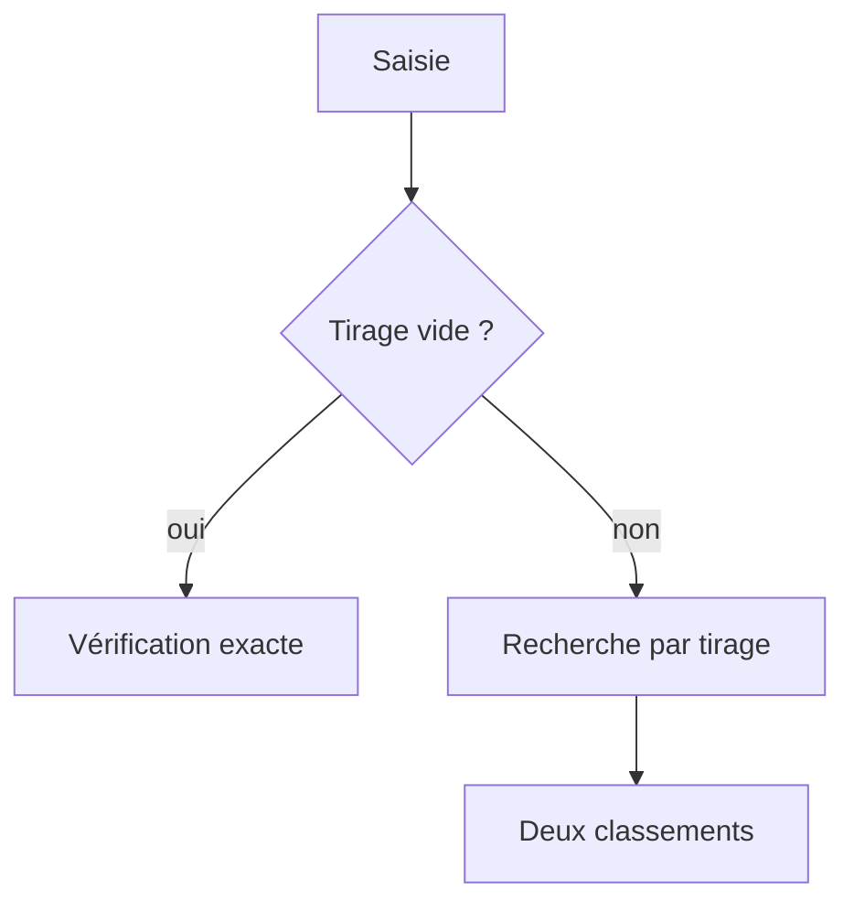

# Algorithme de recherche et de classement des mots

Ce document décrit l'algorithme utilisé par `engine.py` pour déterminer, à
partir d'une série de lettres :

- les N mots les plus longs qui peuvent être formés ;
- les N mots dont les lettres rapportent le plus de points au Scrabble
  français ;
- ou, lorsque le tirage est vide, si le mot saisi dans **Contraintes** figure
  exactement dans le corpus.

Les définitions du Wiktionnaire sont recherchées dans un second temps et
n'interviennent jamais dans la sélection ou le classement des mots.

## Vue d'ensemble



## 1. Préparation du lexique

Le lexique est chargé une seule fois au lancement de l'application. Par
défaut, il s'agit de `lexique-francais.zip`; l’option `--corpus` peut désigner
une autre archive compatible. Le membre `lexique-francais.txt` est lu
directement avec la bibliothèque standard de Python : aucun fichier temporaire
n’est créé sur le disque. Pour chaque ligne :

1. le mot est converti en majuscules ;
2. les formes de plus de 15 lettres sont ignorées sans modifier l'archive ;
3. la longueur et le format des autres formes sont vérifiés ;
4. les doublons sont éliminés ;
5. le nombre d'occurrences de chacune des 26 lettres est calculé ;
6. la valeur totale des lettres est précalculée ;
7. le mot est rangé dans le groupe correspondant à sa longueur.

Chaque mot est donc représenté en mémoire par trois éléments :

```text
mot, tableau_de_26_compteurs, score_de_base
```

Le tableau de compteurs est enregistré sous la forme compacte de 26 octets.
Les mots sont regroupés par longueur, de 2 à 15 lettres. Lors d'une recherche,
l'algorithme peut ainsi ignorer immédiatement tous les mots plus longs que le
nombre de lettres disponibles.

## 2. Normalisation des lettres introduites

La saisie de l'utilisateur est normalisée de la même manière que le
lexique :

- conversion en majuscules ;
- suppression des accents : `É` devient `E` ;
- développement des ligatures : `Œ` devient `OE` et `Æ` devient `AE` ;
- suppression des séparateurs autorisés : espaces, virgules, tirets, etc. ;
- comptage séparé des jokers représentés par `?` ou `*`.

Lors d’une recherche, le tirage doit contenir entre 2 et 15 lettres ou jokers,
dont au maximum deux jokers.
Les contraintes sont saisies dans un champ séparé et ne modifient jamais les
lettres disponibles.

Si le tirage est vide, l’application change de mode : le contenu du champ
**Contraintes** est alors traité comme un mot littéral à vérifier et non comme
une expression régulière.

Un tableau `R` de 26 compteurs est ensuite construit. `R[i]` représente le
nombre d'exemplaires disponibles de la lettre `i` dans le tirage.

## 3. Vérification des contraintes

Le champ de contraintes contient des expressions régulières compatibles avec
le module `re` de Python. Les motifs sont séparés par `;`, les espaces placés
autour sont supprimés et chaque motif est compilé une seule fois, sans tenir
compte de la casse.

Pour chaque mot candidat, le moteur applique successivement tous les motifs
avec une recherche non ancrée. Le mot est rejeté dès qu'un motif ne correspond
pas. Les ancres permettent à l'utilisateur de préciser la position :

- `a` impose la présence de `A` à un endroit quelconque ;
- `^a` impose `A` au début du mot ;
- `e$` impose `E` à la fin du mot ;
- `^..r` impose `R` en troisième position ;
- `u.$` impose `U` en avant-dernière position.

Les contraintes `^j ; ^..r ; a$` sont toutes obligatoires et sont équivalentes
au motif unique `^j.r.*a$`. Une erreur de compilation est présentée à
l'utilisateur avant de lancer la recherche.

## 4. Vérification exacte d’un mot

Le mot saisi est débarrassé des espaces placés aux extrémités, converti en
majuscules, privé de ses diacritiques et ses ligatures `Œ` et `Æ` sont
développées. Tout caractère qui ne correspond pas à une lettre de `A` à `Z`
est rejeté ; la longueur doit rester comprise entre 2 et 15 lettres.

Comme chaque groupe de longueur est trié lors du chargement, le moteur utilise
une recherche par dichotomie. Les symboles tels que `^`, `.`, `$` ou `;` ne
sont jamais interprétés comme des expressions régulières dans ce mode. Le
résultat indique uniquement la présence de la forme dans le corpus Morphalou
dérivé et ne constitue pas une validation officielle de compétition.

## 5. Vérification qu'un mot peut être formé

Pour chaque mot dont la longueur ne dépasse pas le nombre de lettres et de
jokers disponibles, le moteur compare :

- `W[i]` : le nombre d'occurrences de la lettre `i` dans le mot ;
- `R[i]` : le nombre d'occurrences de cette lettre dans le tirage.

Le manque éventuel pour chaque lettre est calculé par :

**Dᵢ = max(0, Wᵢ − Rᵢ)**

Le nombre total de lettres manquantes vaut :

**D = Σᵢ₌₁²⁶ Dᵢ**

Le mot est réalisable si et seulement si :

**D ≤ J**

où `J` est le nombre de jokers disponibles. Le parcours des 26 lettres est
interrompu dès que le nombre de lettres manquantes dépasse `J`.

Cette comparaison respecte les répétitions. Ainsi, un seul `A` dans le tirage
ne suffit pas pour former un mot qui en contient deux, sauf si un joker couvre
le second `A`.

## 6. Calcul des points

Le score de base d'un mot est la somme des valeurs de ses lettres :

| Points | Lettres |
| ---: | --- |
| 1 | A, E, I, L, N, O, R, S, T, U |
| 2 | D, G, M |
| 3 | B, C, P |
| 4 | F, H, V |
| 8 | J, Q |
| 10 | K, W, X, Y, Z |

Lorsqu'un joker remplace une lettre manquante, cette lettre rapporte zéro
point. Le moteur soustrait donc du score de base la valeur de toutes les
lettres couvertes par des jokers :

**Score = ScoreBase − Σᵢ₌₁²⁶ (Dᵢ × Valeurᵢ)**

Exemple : avec le tirage `JAZ?`, le mot `JAZZ` est réalisable. Son score de
base est `8 + 1 + 10 + 10 = 29`. Le joker remplace un `Z`, soit 10 points ; le
score retenu est donc `29 - 10 = 19`.

Le calcul ne tient pas compte :

- des cases multiplicatrices du plateau ;
- des lettres déjà présentes sur la grille ;
- de la prime de 50 points pour l'utilisation des sept lettres.

Il s'agit donc de la valeur brute des lettres utilisées pour former le mot.

## 7. Sélection des mots les plus longs

Les candidats sont classés selon les critères suivants, dans cet ordre :

1. longueur décroissante ;
2. score décroissant en cas d'égalité de longueur ;
3. ordre alphabétique en cas de nouvelle égalité.

La clé de tri employée dans le programme est équivalente à :

```python
(-longueur, -score, mot)
```

## 8. Sélection des meilleurs scores

Le second classement inverse la priorité des deux premiers critères :

1. score décroissant ;
2. longueur décroissante en cas d'égalité de score ;
3. ordre alphabétique en cas de nouvelle égalité.

La clé de tri correspondante est :

```python
(-score, -longueur, mot)
```

Le programme ne conserve que les N meilleurs éléments de chaque
classement. Lorsqu'un candidat valable est trouvé, il est ajouté à chacun des
deux petits tableaux, le tableau est trié, puis tous les éléments au-delà de la
Nème position sont supprimés.

## 9. Pseudocode simplifié

```text
charger et indexer les mots par longueur

si le tirage est vide :
    normaliser le contenu de Contraintes comme un mot littéral
    rechercher ce mot par dichotomie dans son groupe de longueur
    renvoyer présent ou absent
sinon :
    normaliser les lettres introduites
    séparer et compiler les expressions régulières
    compter les lettres du tirage
    meilleurs_longueurs = liste vide
    meilleurs_scores = liste vide

    pour chaque mot dont la longueur est compatible :
        pour chaque expression régulière :
            si l'expression ne correspond pas au mot :
                rejeter immédiatement le mot

        lettres_manquantes = 0
        pénalité_jokers = 0

        pour chacune des 26 lettres :
            déficit = max(0, quantité_dans_mot - quantité_dans_tirage)
            lettres_manquantes += déficit
            pénalité_jokers += déficit × valeur_de_la_lettre

            si lettres_manquantes > nombre_de_jokers :
                rejeter immédiatement le mot

        si le mot est réalisable :
            score = score_de_base - pénalité_jokers
            insérer le mot dans le classement par longueur
            insérer le mot dans le classement par score
            ne conserver que les N premiers de chaque classement
```

## 10. Complexité

Soit `C` le nombre de mots dont la longueur est compatible avec le tirage. Sans
contrainte, le moteur compare au maximum 26 compteurs par mot. Comme la taille
de l'alphabet est constante, cette partie est linéaire par rapport au nombre de
mots examinés :

**O(26C) = O(C)**

Le coût supplémentaire dépend du nombre et de la complexité des expressions
régulières. Il reste faible pour les motifs positionnels prévus ici, notamment
parce qu'un mot chargé ne dépasse jamais 15 lettres. Des expressions
volontairement complexes avec beaucoup de retours arrière peuvent néanmoins
être plus lentes.

La mise à jour des classements ne porte jamais sur plus de `N + 1` éléments,
où `N` est le nombre de résultats demandé, limité à 20 dans l'interface. Les
deux listes de résultats occupent donc un espace borné.

L'index complet occupe un espace proportionnel au nombre de mots : `O(N)`. Il
est construit une fois au lancement afin que les recherches suivantes puissent
être effectuées directement en mémoire, sans requête vers une base de données.

La vérification exacte d’un mot utilise une dichotomie dans le groupe de sa
longueur et s’exécute donc en `O(log Nₗ)`, où `Nₗ` est le nombre de formes de
cette longueur.

## 11. Limites

- La qualité des résultats dépend du corpus sélectionné. Le corpus Morphalou
  utilisé par défaut, comme le corpus multisource candidat, n’est ni une
  reproduction de l’ODS ni une référence officielle ou homologuée pour la
  compétition.
- Un mot peut employer tout ou partie des lettres du tirage ; il n'est pas
  nécessaire de toutes les utiliser.
- L'algorithme recherche des mots isolés. Il ne tient pas compte d'une grille,
  des raccords possibles ni des multiplicateurs.
- Les graphies accentuées sont confondues après normalisation, comme au
  Scrabble francophone.
- Les mots du lexique étant normalisés avec les lettres `A` à `Z`, il est
  préférable d'utiliser des lettres non accentuées dans les motifs.
